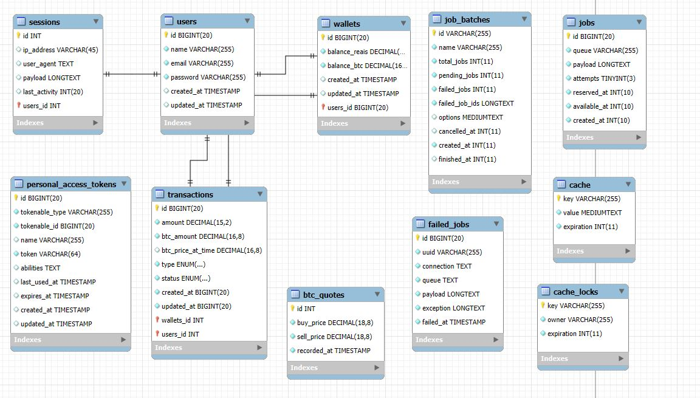

# API de investimento em bitcoins

## Tabela de Conteúdos

1. [Visão Geral](#visão-geral)
2. [Diagrama BD](#diagrama-bd)
3. [Funcionalidades Principais](#funcionalidades-principais)
4. [Tecnologias Utilizadas](#tecnologias-utilizadas)
5. [Instalação e Execução](#instalação-e-execução)

## Visão Geral

A API de investimentos em Bitcoin permite aos clientes gerenciar suas finanças digitais, realizar depósitos, comprar e vender bitcoins, além de obter informações sobre cotação e históricos de transações. A API utiliza autenticação JWT para segurança e envia notificações automáticas por email para manter os clientes informados sobre suas atividades.

## Diagrama BD



## Funcionalidades Principais

### Contas

-   **Cadastro e Login:** O sistema permite o cadastro e login com autenticação para um acesso seguro.

### Depósitos

-  **Depósito de Valores:** Os clientes podem depositar valores em reais, com um email de confirmação enviado após cada depósito.

### Saldo

-   **Consulta de Saldo:** Permite consultar o saldo disponível na conta.

### Compra e Venda de Bitcoin

-   **Compra de Bitcoins:** O cliente pode comprar bitcoins usando o saldo em reais, com a conversão feita pela cotação atual de venda.
-   **Venda de Bitcoin:** O cliente pode vender seus bitcoins, com o valor retornando à conta em reais.

### Cotação

-   **Cotação Bitcoin:** O cliente pode visualizar a cotação em tempo real da compra e venda.

### Posição dos Investimentos

-   **Visualização dos Investimentos:** Permite visualizar a posição dos investimentos com detalhes como data de compra, valor investido, valor do BTC na compra, variação percentual e valor bruto atual.

### Extrato e Histórico

-   **Extrato de Transações:** O cliente pode visualizar o histórico de transações (depósitos, compras e resgates) dos últimos 90 dias ou em um intervalo de datas específico.
-   **Histórico de Cotação:** Histórico do valor de compra e venda do Bitcoin com atualizações a cada 10 minutos nas últimas 24 horas.

### Volume

-   **Volume de Transações:** Endpoint para retornar o total de bitcoins comprados e vendidos no dia corrente.

## Tecnologias Utilizadas

- **[Laravel Framework](https://laravel.com/):** Base sólida e moderna para desenvolvimento web.
- **MariaDB ou Outro Banco de Dados Relacional:** Armazenamento de dados estruturados.
- **Integrações de APIs Externas:** Conexão com serviços externos para funcionalidades específicas.

## Instalação e Execução

### Requisitos

-   PHP 8.2 ou superior
-   Composer
-   Banco de dados Relacional (MariaDB)
- [Docker](https://www.docker.com/) e [Docker Compose](https://docs.docker.com/compose/)

### Instruções de Instalação no Linux

1. Instalar PHP 8.2 e Dependências

Execute os seguintes comandos para instalar o PHP 8.2 no Ubuntu:

    ```bash
    sudo apt update
    sudo apt install software-properties-common
    sudo add-apt-repository ppa:ondrej/php
    sudo apt update
    sudo apt install php8.2 php8.2-cli php8.2-mbstring php8.2-xml php8.2-curl php8.2-mysql
    ```

2. Instalar o Composer

Composer é o gerenciador de dependências para PHP. Instale-o com os seguintes comandos:

    ```bash
    curl -sS https://getcomposer.org/installer | php
    sudo mv composer.phar /usr/local/bin/composer
    ```

3. Instalar Docker e Docker Compose

    Instale o Docker e o Docker Compose no Linux:

    ```bash
    sudo apt install docker.io
    sudo apt install docker-compose
    ```

    Certifique-se de que o Docker esteja rodando e adicione o usuário ao grupo Docker:

    ```bash
    sudo systemctl start docker
    sudo usermod -aG docker ${USER},
    ```


### Passos para Instalação da Aplicação
    
1. Clone este repositório:

    ```bash
    git clone https://github.com/gabriel-americo/
    ```

    ```bash
    cd sistema-cms-laravel
    ```

2. Suba os containers do projeto:

    ```bash
    docker-compose up -d
    ```

3. Crie o Arquivo .env:

    ```bash
    cp .env.example .env
    ```

4. Acesse o container app:

    ```bash
    docker-compose exec app bash
    ```

5. Instale as dependências do Composer:

    ```bash
    composer install
    ```

6. Configure o arquivo `.env` com as informações do banco de dados:

    ```env
    DB_CONNECTION=mysql
    DB_HOST=seu-host
    DB_PORT=sua-porta
    DB_DATABASE=seu-banco-de-dados
    DB_USERNAME=seu-usuario
    DB_PASSWORD=sua-senha
    ```

7. Gere a key do projeto Laravel:

    ```bash
    php artisan key:generate
    ```

8. Execute as migrações para criar as tabelas no banco de dados:

    ```bash
    php artisan migrate
    ```

9. Cria um link simbólico para o diretório public/storage (Upload de imagens):

    ```bash
    php artisan storage:link
    ```

10. Acesse o projeto:

    ```bash
    http://localhost:8000
    ```
